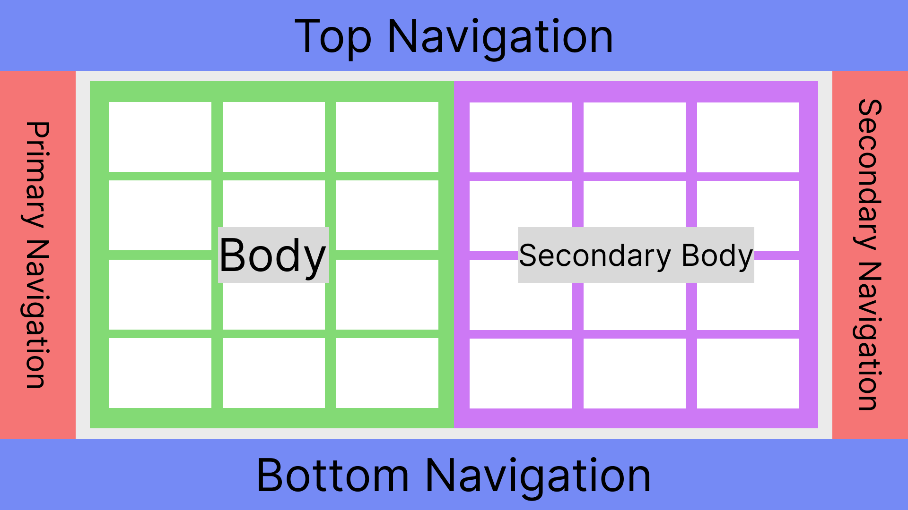
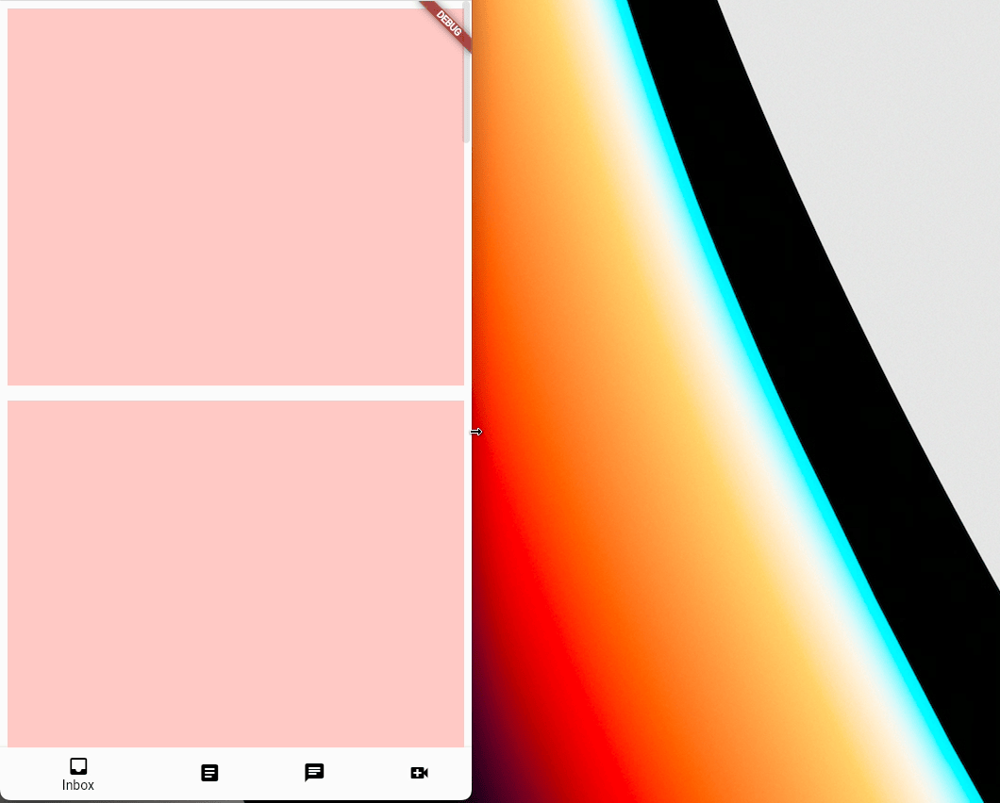

[](https://pub.dev/packages/arcane_analysis)

# (Custom) Adaptive Scaffold

`AdaptiveScaffold` reacts to input from users, devices and screen elements and
renders your Flutter application according to the
[Material 3](https://m3.material.io/foundations/adaptive-design/overview)
guidelines.

**Important**: This source code is derived from the original code found in
`package:flutter_adaptive_scaffold` as well as the Flutter framework, itself.
Modifications have been made to the original source code that provide some
additional customizations, such as padding and margins. The package keeps
Flutter-parity defaults where possible and exposes opt-in customization points
for behavior that intentionally diverges.

## How This Package Differs From Flutter

This package intentionally diverges from Flutter framework/adaptive defaults in
several places:

- Adaptive layout helpers:
  - Adds `AdaptiveScaffoldController`, `AdaptiveScaffoldScope`, and
    `AdaptiveBody` for explicit collapsed pane intent control.
- Navigation bar destination customization:
  - `CustomNavigationDestination.hideLabel` for per-destination label hiding.
  - `transitionAnimation`, `transitionCurve`, `transitionDuration` for built-in
    icon transition presets.
  - `iconBuilder` for fully custom icon transitions.
  - `transitionBuilder` for full-content icon+label transition composition.
  - `iconIndicatorShape` and `labelIndicatorShape` for scoped indicator bubbles.
- Navigation rail customization:
  - Rail destination icon transitions (`iconTransitionAnimation`, curve,
    duration) and destination-level `destinationTransitionBuilder`.
  - Extended layout controls (`leadingAtTop`, `trailingAtBottom`, `scrollable`,
    `mainAxisAlignment`).
  - Configurable rail destination fill/highlight via
    `destinationFillMode` and `destinationFillShape`.
  - `AdaptiveScaffold` exposes the same fill options through
    `navigationTheme: AdaptiveScaffoldNavigationThemeData(...)`.
- Theme extensions:
  - `CustomNavigationBarThemeData`: `margin`, `padding`,
    `tooltipVerticalOffset`.
  - `CustomNavigationRailThemeData`: `margin`, `padding`.
- Compatibility bridge behavior:
  - Adaptive destination normalization allows using plain
    `NavigationDestination` inputs in APIs that render custom destinations.

To see examples of using these widgets to make a simple but common adaptive
layout:

```bash
cd example/
flutter run --release
```

## AdaptiveScaffold

`AdaptiveScaffold` implements the basic visual layout structure for Material
Design 3 that adapts to a variety of screens. It provides a preset of layout,
including positions and animations, by handling macro changes in navigational
elements and bodies based on the current features of the screen, namely screen
width and platform. For example, the navigational elements would be a
`BottomNavigationBar` on a small mobile device and a `CustomNavigationRail` on larger
devices. The body is the primary screen that takes up the space left by the
navigational elements. The secondaryBody acts as an option to split the space
between two panes for purposes such as having a detail view. There is some
automatic functionality with foldables to handle the split between panels
properly. `AdaptiveScaffold` is much simpler to use but is not the best if you
would like high customizability. Apps that would like more refined layout and/or
animation should use `AdaptiveLayout`.

### Panel Primary/Secondary Behavior

`AdaptiveScaffold` now supports an optional pane-intent controller for
primary/secondary style flows:

- `controller: AdaptiveScaffoldController?`

When a controller is provided, pane visibility on collapsed layouts can be
controlled explicitly:

- On the `smallBreakpoint`:
  - `PanelFocus.body` shows the body/list pane.
  - `PanelFocus.secondaryBody` shows the secondary/details pane.
- On `mediumBreakpoint` and larger:
  - Layout remains dual-pane according to existing slot configuration.
  - Controller intent does not force one pane to hide.

Important behavior details:

- This is fully opt-in. If `controller` is not supplied, behavior
  remains unchanged.
- The collapsed pane switch is only active when both
  `controller != null`, `secondaryBody != null`, and the controller has an
  explicit pane intent.
- `AdaptiveScaffoldController()` starts with no explicit pane intent, so
  collapsed layouts preserve legacy dual-pane behavior until
  `showBody()` or `showSecondaryBody()` is called.
- Pass `initialIntent` to opt into immediate collapsed single-pane behavior:
  - `AdaptiveScaffoldController(initialIntent: PanelFocus.body)`
  - `AdaptiveScaffoldController(initialIntent: PanelFocus.secondaryBody)`
- `AdaptiveScaffold` listens to controller updates and rebuilds automatically.
- `AdaptiveScaffoldScope` is inserted only when a controller is provided.

This design keeps routing concerns outside the package. The package controls
pane intent and layout visibility only.

### AdaptiveBody Context

`AdaptiveScaffold` now wraps active body and secondaryBody slot content in
`AdaptiveBody`, which exposes whether the current layout is collapsed:

```dart
final bool isCollapsed = AdaptiveBody.of(context)?.viewIsCollapsed ?? false;
```

This allows descendants to adapt UI behavior (for example, showing an inline
back affordance only on collapsed layouts) without coupling to route state.

### Primary/Secondary API Summary

New exports are available from `package:custom_adaptive_scaffold/custom_adaptive_scaffold.dart`:

- `PanelFocus` enum (`body`, `secondaryBody`)
- `AdaptiveScaffoldController`
  - `showBody()`
  - `showSecondaryBody()`
- `AdaptiveScaffoldScope`
  - `AdaptiveScaffoldScope.of(context)`
  - `AdaptiveScaffoldScope.maybeOf(context)`
- `AdaptiveBody`
  - `AdaptiveBody.of(context)`
  - `viewIsCollapsed`

### Primary/Secondary Example

```dart
class _MailScreenState extends State<MailScreen> {
  final AdaptiveScaffoldController _controller = AdaptiveScaffoldController();

  @override
  void dispose() {
    _controller.dispose();
    super.dispose();
  }

  @override
  Widget build(BuildContext context) {
    return AdaptiveScaffold(
      destinations: const <NavigationDestination>[
        NavigationDestination(icon: Icon(Icons.inbox), label: "Inbox"),
        NavigationDestination(icon: Icon(Icons.send), label: "Sent"),
      ],
      controller: _controller,
      smallBody: (context) => MessageList(
        onMessageTap: () => _controller.showSecondaryBody(),
      ),
      body: (context) => MessageList(
        onMessageTap: () => _controller.showSecondaryBody(),
      ),
      smallSecondaryBody: (context) => MessageDetails(
        onBack: _controller.showBody,
      ),
      secondaryBody: (context) => const MessageDetails(),
    );
  }
}
```

### Migration Notes

- Existing users of `AdaptiveScaffold` do not need to change anything.
- To adopt pane intent behavior incrementally:
  1. Add an `AdaptiveScaffoldController`.
  2. Pass it to `AdaptiveScaffold(controller: ...)`.
  3. Toggle intent with `showBody()` and `showSecondaryBody()` from UI events.
  4. Use `AdaptiveBody.of(context)?.viewIsCollapsed` in descendants when
     collapsed-specific behavior is needed.

## CustomNavigationDestination

`CustomNavigationDestination` extends `NavigationDestination` with additional
capabilities for per-destination label control, animated icon transitions, and
fine-grained selection indicator placement.

### Per-destination label visibility

Set `hideLabel: true` to suppress the label on a single destination without
affecting the bar-level `NavigationDestinationLabelBehavior`:

```dart
const CustomNavigationDestination(
  icon: Icon(Icons.search_outlined),
  label: "Search",  // still used for semantics and tooltip
  hideLabel: true,  // not rendered visually
),
```

### Animated icon transitions

Use the built-in presets for common animations:

```dart
const CustomNavigationDestination(
  icon: Icon(Icons.home_outlined),
  selectedIcon: Icon(Icons.home),
  label: "Home",
  transitionAnimation: NavigationDestinationAnimation.fadeSwap,
  transitionCurve: Curves.easeInOut,
  transitionDuration: Duration(milliseconds: 250),
),
```

Available presets:

- `NavigationDestinationAnimation.none` — instant swap (default)
- `NavigationDestinationAnimation.fadeSwap` — cross-fade between icons
- `NavigationDestinationAnimation.scale` — scale-in / scale-out

For fully custom icon animation, use `iconBuilder`. It receives the raw
`Animation<double>`, an `isSelecting` flag indicating the direction of the
transition, and both pre-themed icon widgets:

```dart
CustomNavigationDestination(
  icon: const Icon(Icons.inbox_outlined),
  selectedIcon: const Icon(Icons.inbox),
  label: "Inbox",
  iconBuilder: (
    BuildContext context,
    Animation<double> animation,
    bool isSelecting,
    Widget unselectedIcon,
    Widget selectedIcon,
  ) {
    // isSelecting is true when transitioning toward selected,
    // false when transitioning toward deselected.
    return AnimatedSwitcher(
      duration: const Duration(milliseconds: 300),
      transitionBuilder: (child, anim) => SlideTransition(
        position: Tween<Offset>(
          begin: isSelecting ? const Offset(0, 1) : const Offset(0, -1),
          end: Offset.zero,
        ).animate(anim),
        child: child,
      ),
      child: animation.isForwardOrCompleted
          ? KeyedSubtree(key: const ValueKey("sel"), child: selectedIcon)
          : KeyedSubtree(key: const ValueKey("unsel"), child: unselectedIcon),
    );
  },
),
```

### Full icon+label transition composition

Use `transitionBuilder` when icon and label should transition together:

```dart
CustomNavigationDestination(
  icon: const Icon(Icons.video_call_outlined),
  selectedIcon: const Icon(Icons.video_call),
  label: "Video",
  transitionBuilder: (
    BuildContext context,
    Animation<double> animation,
    bool isSelecting,
    Widget unselectedIcon,
    Widget selectedIcon,
    Widget unselectedLabel,
    Widget selectedLabel,
  ) {
    return Column(
      mainAxisAlignment: MainAxisAlignment.center,
      children: <Widget>[
        FadeTransition(
          opacity: animation,
          child: animation.isForwardOrCompleted ? selectedIcon : unselectedIcon,
        ),
        const SizedBox(height: 4),
        FadeTransition(
          opacity: animation,
          child: animation.isForwardOrCompleted ? selectedLabel : unselectedLabel,
        ),
      ],
    );
  },
),
```

### Custom navigation rail transitions

`CustomNavigationRail` supports destination transition controls similar to
`CustomNavigationDestination`, including a destination-level
`destinationTransitionBuilder` for coordinated icon/label transitions.

### Destination Fill Modes

By default, `CustomNavigationRail` follows Flutter-style selection rendering,
where the indicator sits behind the icon area.

When you want custom destination fill/highlight scopes, choose a
`destinationFillMode`:

- `none`
- `icon`
- `content`
- `label`
- `full`

Example using full-widget fill plus a custom shape:

```dart
CustomNavigationRail(
  selectedIndex: selectedIndex,
  destinationFillMode: NavigationDestinationFillMode.full,
  destinationFillShape: RoundedRectangleBorder(
    borderRadius: BorderRadius.circular(12),
  ),
  destinations: destinations,
)
```

Color is resolved from theme indicator color (`NavigationRailThemeData.indicatorColor`).

`AdaptiveScaffold.standardNavigationRail` exposes the same options:

```dart
AdaptiveScaffold.standardNavigationRail(
  selectedIndex: selectedIndex,
  destinations: railDestinations,
  destinationFillMode: NavigationDestinationFillMode.full,
  destinationFillShape: RoundedRectangleBorder(
    borderRadius: BorderRadius.circular(12),
  ),
)
```

For `AdaptiveScaffold`, configure fill/highlight through
`AdaptiveScaffoldNavigationThemeData`:

```dart
AdaptiveScaffold(
  destinations: destinations,
  navigationTheme: const AdaptiveScaffoldNavigationThemeData(
    destinationFillMode: NavigationDestinationFillMode.label,
    destinationFillShape: StadiumBorder(),
  ),
  body: (BuildContext context) => const Placeholder(),
)
```

Migration step for existing apps (pre 4.0.0):

If your app previously depended on full selected-destination fill behavior,
set `destinationFillMode: NavigationDestinationFillMode.full` on
`CustomNavigationRail` (or on `AdaptiveScaffold.standardNavigationRail` when
using the helper).

### Scoped selection indicator

By default the selection indicator fills the entire destination item.
Use `iconIndicatorShape` or `labelIndicatorShape` to scope it to just the icon
or just the label. Setting either field suppresses the full-item indicator.

```dart
// Indicator around icon only:
const CustomNavigationDestination(
  icon: Icon(Icons.person_outline),
  label: "Profile",
  iconIndicatorShape: CircleBorder(),
),

// Indicator around label only:
const CustomNavigationDestination(
  icon: Icon(Icons.notifications_outlined),
  label: "Alerts",
  labelIndicatorShape: StadiumBorder(),
),

// Separate bubbles for icon and label:
const CustomNavigationDestination(
  icon: Icon(Icons.chat_outlined),
  label: "Chat",
  iconIndicatorShape: CircleBorder(),
  labelIndicatorShape: StadiumBorder(),
),
```

### Tooltip

`tooltip` is `null` by default and truly suppresses the tooltip when omitted.
Pass a non-null string to show a custom tooltip on long press:

```dart
const CustomNavigationDestination(
  icon: Icon(Icons.settings_outlined),
  label: "Settings",
  tooltip: "App settings",  // shown on long press
),

const CustomNavigationDestination(
  icon: Icon(Icons.search_outlined),
  label: "Search",
  // tooltip omitted → no tooltip shown
),
```

### Example Usage

<?code-excerpt "example/lib/adaptive_scaffold_demo.dart (Example)"?>

```dart
@override
Widget build(BuildContext context) {
  // Define the children to display within the body at different breakpoints.
  final List<Widget> children = <Widget>[
    for (int i = 0; i < 10; i++)
      Padding(
        padding: const EdgeInsets.all(8.0),
        child: Container(
          color: const Color.fromARGB(255, 255, 201, 197),
          height: 400,
        ),
      )
  ];
  return AdaptiveScaffold(
    // An option to override the default transition duration.
    transitionDuration: Duration(milliseconds: _transitionDuration),
    // An option to override the default breakpoints used for small, medium,
    // mediumLarge, large, and extraLarge.
    smallBreakpoint: const Breakpoint(endWidth: 700),
    mediumBreakpoint: const Breakpoint(beginWidth: 700, endWidth: 1000),
    mediumLargeBreakpoint: const Breakpoint(beginWidth: 1000, endWidth: 1200),
    largeBreakpoint: const Breakpoint(beginWidth: 1200, endWidth: 1600),
    extraLargeBreakpoint: const Breakpoint(beginWidth: 1600),
    useDrawer: false,
    selectedIndex: _selectedTab,
    onSelectedIndexChange: (int index) {
      setState(() {
        _selectedTab = index;
      });
    },
    destinations: const <CustomNavigationDestination>[
      CustomNavigationDestination(
        icon: Icon(Icons.inbox_outlined),
        selectedIcon: Icon(Icons.inbox),
        label: 'Inbox',
      ),
      CustomNavigationDestination(
        icon: Icon(Icons.article_outlined),
        selectedIcon: Icon(Icons.article),
        label: 'Articles',
      ),
      CustomNavigationDestination(
        icon: Icon(Icons.chat_outlined),
        selectedIcon: Icon(Icons.chat),
        label: 'Chat',
      ),
      CustomNavigationDestination(
        icon: Icon(Icons.video_call_outlined),
        selectedIcon: Icon(Icons.video_call),
        label: 'Video',
      ),
      CustomNavigationDestination(
        icon: Icon(Icons.home_outlined),
        selectedIcon: Icon(Icons.home),
        label: 'Inbox',
      ),
    ],
    smallBody: (_) => ListView.builder(
      itemCount: children.length,
      itemBuilder: (_, int idx) => children[idx],
    ),
    body: (_) => GridView.count(crossAxisCount: 2, children: children),
    mediumLargeBody: (_) =>
        GridView.count(crossAxisCount: 3, children: children),
    largeBody: (_) => GridView.count(crossAxisCount: 4, children: children),
    extraLargeBody: (_) =>
        GridView.count(crossAxisCount: 5, children: children),
    // Define a default secondaryBody.
    // Override the default secondaryBody during the smallBreakpoint to be
    // empty. Must use AdaptiveScaffold.emptyBuilder to ensure it is properly
    // overridden.
    smallSecondaryBody: AdaptiveScaffold.emptyBuilder,
    secondaryBody: (_) => Container(
      color: const Color.fromARGB(255, 234, 158, 192),
    ),
    mediumLargeSecondaryBody: (_) => Container(
      color: const Color.fromARGB(255, 234, 158, 192),
    ),
    largeSecondaryBody: (_) => Container(
      color: const Color.fromARGB(255, 234, 158, 192),
    ),
    extraLargeSecondaryBody: (_) => Container(
      color: const Color.fromARGB(255, 234, 158, 192),
    ),
  );
}
```

## The Background Widget Suite

These are the set of widgets that are used on a lower level and offer more
customizability at a cost of more lines of code.

### Breakpoint

A `Breakpoint` controls the responsive behavior at different screens and configurations.

You can either use a predefined Material3 breakpoint or create your own.

<?code-excerpt "lib/src/breakpoints.dart (Breakpoints)"?>

```dart
/// Returns a const [Breakpoint] with the given constraints.
const Breakpoint({
  this.beginWidth,
  this.endWidth,
  this.beginHeight,
  this.endHeight,
  this.andUp = false,
  this.platform,
  this.spacing = kMaterialMediumAndUpSpacing,
  this.margin = kMaterialMediumAndUpMargin,
  this.padding = kMaterialPadding,
  this.recommendedPanes = 1,
  this.maxPanes = 1,
});

/// Returns a [Breakpoint] that can be used as a fallthrough in the
/// case that no other breakpoint is active.
const Breakpoint.standard({this.platform})
    : beginWidth = -1,
      endWidth = null,
      beginHeight = null,
      endHeight = null,
      spacing = kMaterialMediumAndUpSpacing,
      margin = kMaterialMediumAndUpMargin,
      padding = kMaterialPadding,
      recommendedPanes = 1,
      maxPanes = 1,
      andUp = true;

/// Returns a [Breakpoint] with the given constraints for a small screen.
const Breakpoint.small({this.andUp = false, this.platform})
    : beginWidth = 0,
      endWidth = 600,
      beginHeight = null,
      endHeight = 480,
      spacing = kMaterialCompactSpacing,
      margin = kMaterialCompactMargin,
      padding = kMaterialPadding,
      recommendedPanes = 1,
      maxPanes = 1;

/// Returns a [Breakpoint] with the given constraints for a medium screen.
const Breakpoint.medium({this.andUp = false, this.platform})
    : beginWidth = 600,
      endWidth = 840,
      beginHeight = 480,
      endHeight = 900,
      spacing = kMaterialMediumAndUpSpacing,
      margin = kMaterialMediumAndUpMargin,
      padding = kMaterialPadding * 2,
      recommendedPanes = 1,
      maxPanes = 2;

/// Returns a [Breakpoint] with the given constraints for a mediumLarge screen.
const Breakpoint.mediumLarge({this.andUp = false, this.platform})
    : beginWidth = 840,
      endWidth = 1200,
      beginHeight = 900,
      endHeight = null,
      spacing = kMaterialMediumAndUpSpacing,
      margin = kMaterialMediumAndUpMargin,
      padding = kMaterialPadding * 3,
      recommendedPanes = 2,
      maxPanes = 2;

/// Returns a [Breakpoint] with the given constraints for a large screen.
const Breakpoint.large({this.andUp = false, this.platform})
    : beginWidth = 1200,
      endWidth = 1600,
      beginHeight = 900,
      endHeight = null,
      spacing = kMaterialMediumAndUpSpacing,
      margin = kMaterialMediumAndUpMargin,
      padding = kMaterialPadding * 4,
      recommendedPanes = 2,
      maxPanes = 2;

/// Returns a [Breakpoint] with the given constraints for an extraLarge screen.
const Breakpoint.extraLarge({this.andUp = false, this.platform})
    : beginWidth = 1600,
      endWidth = null,
      beginHeight = 900,
      endHeight = null,
      spacing = kMaterialMediumAndUpSpacing,
      margin = kMaterialMediumAndUpMargin,
      padding = kMaterialPadding * 5,
      recommendedPanes = 2,
      maxPanes = 3;
```

It is possible to compare Breakpoints:

<?code-excerpt "lib/src/breakpoints.dart (Breakpoint operators)"?>

```dart
/// Returns true if this [Breakpoint] is greater than the given [Breakpoint].
bool operator >(Breakpoint breakpoint)
// ···
/// Returns true if this [Breakpoint] is less than the given [Breakpoint].
bool operator <(Breakpoint breakpoint)
// ···
/// Returns true if this [Breakpoint] is greater than or equal to the
/// given [Breakpoint].
bool operator >=(Breakpoint breakpoint)
// ···
/// Returns true if this [Breakpoint] is less than or equal to the
/// given [Breakpoint].
bool operator <=(Breakpoint breakpoint)
// ···
/// Returns true if this [Breakpoint] is between the given [Breakpoint]s.
bool between(Breakpoint lower, Breakpoint upper)
```

### AdaptiveLayout


`AdaptiveLayout` is the top-level widget class that arranges the layout of the
slots and their animation, similar to Scaffold. It takes in several LayoutSlots
and returns an appropriate layout based on the diagram above. `AdaptiveScaffold`
is built upon `AdaptiveLayout` internally but abstracts some of the complexity
with presets based on the Material 3 Design specification.

### SlotLayout

`SlotLayout` handles the adaptivity or the changes between widgets at certain
`Breakpoints`. It also holds the logic for animating between breakpoints. It takes
SlotLayoutConfigs mapped to Breakpoints in a config and displays a widget based
on that information.

### SlotLayout.from

SlotLayout.from creates a SlotLayoutConfig holds the actual widget to be
displayed and the entrance animation and exit animation.

### Example Usage

<?code-excerpt "example/lib/adaptive_layout_demo.dart (Example)"?>

```dart
// AdaptiveLayout has a number of slots that take SlotLayouts and these
// SlotLayouts' configs take maps of Breakpoints to SlotLayoutConfigs.
return AdaptiveLayout(
  // An option to override the default transition duration.
  transitionDuration: Duration(milliseconds: _transitionDuration),
  // Primary navigation config has nothing from 0 to 600 dp screen width,
  // then an unextended NavigationRail with no labels and just icons then an
  // extended NavigationRail with both icons and labels.
  primaryNavigation: SlotLayout(
    config: <Breakpoint, SlotLayoutConfig>{
      Breakpoints.medium: SlotLayout.from(
        inAnimation: AdaptiveScaffold.leftOutIn,
        key: const Key('Primary Navigation Medium'),
        builder: (_) => AdaptiveScaffold.standardNavigationRail(
          selectedIndex: selectedNavigation,
          onDestinationSelected: (int newIndex) {
            setState(() {
              selectedNavigation = newIndex;
            });
          },
          leading: const Icon(Icons.menu),
          destinations: destinations
              .map((NavigationDestination destination) =>
                  AdaptiveScaffold.toRailDestination(destination))
              .toList(),
          backgroundColor: navRailTheme.backgroundColor,
          selectedIconTheme: navRailTheme.selectedIconTheme,
          unselectedIconTheme: navRailTheme.unselectedIconTheme,
          selectedLabelTextStyle: navRailTheme.selectedLabelTextStyle,
          unSelectedLabelTextStyle: navRailTheme.unselectedLabelTextStyle,
        ),
      ),
      Breakpoints.mediumLarge: SlotLayout.from(
        key: const Key('Primary Navigation MediumLarge'),
        inAnimation: AdaptiveScaffold.leftOutIn,
        builder: (_) => AdaptiveScaffold.standardNavigationRail(
          selectedIndex: selectedNavigation,
          onDestinationSelected: (int newIndex) {
            setState(() {
              selectedNavigation = newIndex;
            });
          },
          extended: true,
          leading: Row(
            mainAxisAlignment: MainAxisAlignment.spaceAround,
            children: <Widget>[
              Text(
                'REPLY',
                style: headerColor,
              ),
              const Icon(Icons.menu_open)
            ],
          ),
          destinations: destinations
              .map((NavigationDestination destination) =>
                  AdaptiveScaffold.toRailDestination(destination))
              .toList(),
          trailing: trailingNavRail,
          backgroundColor: navRailTheme.backgroundColor,
          selectedIconTheme: navRailTheme.selectedIconTheme,
          unselectedIconTheme: navRailTheme.unselectedIconTheme,
          selectedLabelTextStyle: navRailTheme.selectedLabelTextStyle,
          unSelectedLabelTextStyle: navRailTheme.unselectedLabelTextStyle,
        ),
      ),
      Breakpoints.large: SlotLayout.from(
        key: const Key('Primary Navigation Large'),
        inAnimation: AdaptiveScaffold.leftOutIn,
        builder: (_) => AdaptiveScaffold.standardNavigationRail(
          selectedIndex: selectedNavigation,
          onDestinationSelected: (int newIndex) {
            setState(() {
              selectedNavigation = newIndex;
            });
          },
          extended: true,
          leading: Row(
            mainAxisAlignment: MainAxisAlignment.spaceAround,
            children: <Widget>[
              Text(
                'REPLY',
                style: headerColor,
              ),
              const Icon(Icons.menu_open)
            ],
          ),
          destinations: destinations
              .map((NavigationDestination destination) =>
                  AdaptiveScaffold.toRailDestination(destination))
              .toList(),
          trailing: trailingNavRail,
          backgroundColor: navRailTheme.backgroundColor,
          selectedIconTheme: navRailTheme.selectedIconTheme,
          unselectedIconTheme: navRailTheme.unselectedIconTheme,
          selectedLabelTextStyle: navRailTheme.selectedLabelTextStyle,
          unSelectedLabelTextStyle: navRailTheme.unselectedLabelTextStyle,
        ),
      ),
      Breakpoints.extraLarge: SlotLayout.from(
        key: const Key('Primary Navigation ExtraLarge'),
        inAnimation: AdaptiveScaffold.leftOutIn,
        builder: (_) => AdaptiveScaffold.standardNavigationRail(
          selectedIndex: selectedNavigation,
          onDestinationSelected: (int newIndex) {
            setState(() {
              selectedNavigation = newIndex;
            });
          },
          extended: true,
          leading: Row(
            mainAxisAlignment: MainAxisAlignment.spaceAround,
            children: <Widget>[
              Text(
                'REPLY',
                style: headerColor,
              ),
              const Icon(Icons.menu_open)
            ],
          ),
          destinations: destinations
              .map((NavigationDestination destination) =>
                  AdaptiveScaffold.toRailDestination(destination))
              .toList(),
          trailing: trailingNavRail,
          backgroundColor: navRailTheme.backgroundColor,
          selectedIconTheme: navRailTheme.selectedIconTheme,
          unselectedIconTheme: navRailTheme.unselectedIconTheme,
          selectedLabelTextStyle: navRailTheme.selectedLabelTextStyle,
          unSelectedLabelTextStyle: navRailTheme.unselectedLabelTextStyle,
        ),
      ),
    },
  ),
  // Body switches between a ListView and a GridView from small to medium
  // breakpoints and onwards.
  body: SlotLayout(
    config: <Breakpoint, SlotLayoutConfig>{
      Breakpoints.small: SlotLayout.from(
        key: const Key('Body Small'),
        builder: (_) => ListView.builder(
          itemCount: children.length,
          itemBuilder: (BuildContext context, int index) => children[index],
        ),
      ),
      Breakpoints.medium: SlotLayout.from(
        key: const Key('Body Medium'),
        builder: (_) =>
            GridView.count(crossAxisCount: 2, children: children),
      ),
      Breakpoints.mediumLarge: SlotLayout.from(
        key: const Key('Body MediumLarge'),
        builder: (_) =>
            GridView.count(crossAxisCount: 3, children: children),
      ),
      Breakpoints.large: SlotLayout.from(
        key: const Key('Body Large'),
        builder: (_) =>
            GridView.count(crossAxisCount: 4, children: children),
      ),
      Breakpoints.extraLarge: SlotLayout.from(
        key: const Key('Body ExtraLarge'),
        builder: (_) =>
            GridView.count(crossAxisCount: 5, children: children),
      ),
    },
  ),
  // BottomNavigation is only active in small views defined as under 600 dp
  // width.
  bottomNavigation: SlotLayout(
    config: <Breakpoint, SlotLayoutConfig>{
      Breakpoints.small: SlotLayout.from(
        key: const Key('Bottom Navigation Small'),
        inAnimation: AdaptiveScaffold.bottomToTop,
        outAnimation: AdaptiveScaffold.topToBottom,
        builder: (_) => AdaptiveScaffold.standardBottomNavigationBar(
          destinations: destinations,
          currentIndex: selectedNavigation,
          onDestinationSelected: (int newIndex) {
            setState(() {
              selectedNavigation = newIndex;
            });
          },
        ),
      )
    },
  ),
);
```

Both of the examples shown here produce the same output:

